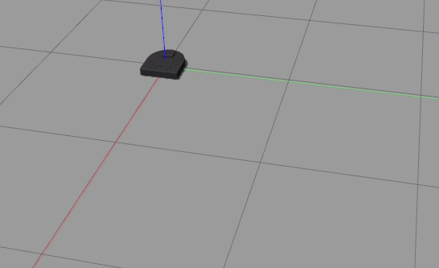

# CompRobo: Warmup_project
### Abby Fry and Vienna Scheyer

## Robot Telop
For our teleop, we went with a pretty straight forward implementation where our robot can move forwards and backwards and turn clockwise and counter clockwise at varying speeds.  The user can also pause the robot. The key mapping for the described movements are as follows.

We opted for the robot to continue moving in the direction of the most recent key press until the pause key was pressed because it seemed preferable to only moving the robot forwards a set amount with each key press.  We also opted to turn rather than have a move left/right command so that the driver of the robot could turn the neato's heading to the desired angle rather than driving forwards and trying to turn at the same time.

## Driving in a Square
The robot moves in an approximately 1 by 1 meter square path by first driving in a straight line at a specified speed for set time and then turning counter clockwise for a set time at a set speed. The diagram shows the timing increments the neato used to turn and drive forward while completing a square.

Using the time implementation, we had to tune the speed/time paramters of our square. Despite this additional tuning step, the time implementation was overall a quick process and it allowed us to focused more on other challenges.

We originally attemped to implement an odometery version of driving in a square but we where having challenges turning the neato to a precise location.  We pivoted to the time implementation for the sake of moving on. After gaining experience from the other challenges, we see that perhaps a proportional controller could have helped our odometery implementation be more successful.

This gif shows the neato driving in a square:

## Wall Following
In the wall following behavior, the neato aims to position itself parallel to the wall. Using lidar sensors at 
 

## Person Following
In person following, the neato pursues a "person" by following at a specified distance of 1 meter.  To do this, our neato begins by performing a 360 lidar scan to check for a person. If all lidar values are infinity that means no person is present, but if any lidar values are non-infinite we add those values to a lidar_range_list. We use the minimum value in the lidar_range_list to determine the desired heading because theoretically the center of a round object will be the closest point. If this desired heading is within +/- 3 degrees of the neato's current heading, the neato drives forward until it is within range of the person. Otherwise, the neato rotates until it is facing the person. For the rotation we use proportional control so that the neato comes to a smooth stop at the desired heading. The following diagram shows the neato registering the presence of a person, turning towards the person, and then moving towards the person.

We discovered a fundamental flaw in our algorithm the first time we tested it without a person in the neato's lidar range. This resulted in some alarming neato motion because the neato was trying to use proportional control on an infinite distance. Once we added a clause to handle the case where all lidar readings are infinite, the person following algorithm worked quite reliably.
## Object Avoidance
In object avoidance, the neato only proceeds forward is there is no object within 1 meter in it's lidar scan from +/- 20° from 0°.  In situations where an object violates those conditions, the neato turns until there is no object within 1 meter.  Otherwise, the neato drives forward.  In the diagram below, the neato would drive forward in case 2 and 3.  For case 1, the neato would turn until the conditions needed to drive forward are met.

In implementing object avoidance, we originally wanted the neato to drive forward only if it saw no object at from +/- 20° from 0°.  However, that meant the neato was unable to navigate situations where there was more than 1 obstacle.  This led us to make it so the neato was avoiding objects only within a meter of it so the robot could navigate more complex situations.  We also had to adjust the tolerance around 0° so that neato was able to identify a path forward that was wide enough for it but that the path requirements weren't so large that the neato could only navigate very simple obstacles.
## Finite State Control
For finite state control, we chose to use a flag to denote whether or not a person is present. The run function checks this flag and sets the state accordingly. The following diagram shows the states and transitions of the FSM.

In our debugging process, we sometimes had a hard time narrowing down the issue since it was hard to tell which state was active and which parts worked. We found it to be very effective to disable one state at a time to identify bugs and work our way up to the functional FSM.
## Overal Project

### Code Structure
Each behavior implemented is it's own class.  Each class has a run method that is called in the main function. The run method calls various helper function, such as monitoring if the desired position of the robot has been achieved.  In each class we also defined many attributes in the init method, some of which were updated to new values while the program was running.
### Challenges/Areas for Improvment
### Key takeways
* Incremental development:
We made the mistake on the first few challenges of immediately jumping into writing code and this strategy stopped working once the problems got harder.  By discussing an outline for the code we were able to implement later challenges quickly and have a common understanding of our strategy.
* Drawing as a planning tool:
Drawing the different case really helped for the challenges like wall following, obstacle avoidance, and person following.  The drawings helped us to grapples with the reference frames and consider more edge cases than just visualizing it in our heads.
* Realistic goals: When starting to project we had hopes of not doing the simplest implpmentation of every challenge.  However, we are both new to ROS and found the learning curve at the beginning quite steep. This led to us spending a lot of time on some of the early challenges with limited successs and then ended up still needing to pivot to simpler implementations.  It probably would have been better for us to do the simple strategy first and then go back and try more the more difficult strategies if there was still time left.
